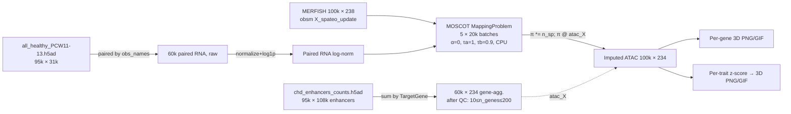

# ATAC → 3D Spatial Mapping (CHD enhancers, PCW 11–13)

## Executive Summary

Chromatin accessibility from CHD-enhancer scATAC-seq was projected onto 3D
MERFISH spatial coordinates by **reusing a MOSCOT scRNA → MERFISH transport
matrix in a cross-modality manner**. Pipeline runs end-to-end on this Mac
(JAX CPU) in ~12 min. All 234 gene-aggregated ATAC features are now visualized
in 3D and aggregated per disease trait.

| Stage | Output | Cells | Features |
|---|---|---|---|
| Paired RNA | `data/for_atac_mapping_rna.h5ad`  | 60 187 | 31 019 |
| Paired ATAC | `data/for_atac_mapping_atac.h5ad` | 60 187 | 234 |
| Imputed ATAC on MERFISH | `data/adata_imputed_atac.h5ad` | 100 000 | 234 |

## Methods



### Step 1 — Paired RNA/ATAC ([13_prepare_atac_rna_paired.py](file:///Users/weizexu/Projects/pantheonos-reproducibility/human-heart/PCW12_analysis/scripts/13_prepare_atac_rna_paired.py))
1. Load `chd_enhancers_counts.h5ad` (95684 × 108681).
2. Build sparse aggregator (108681 enhancers → 234 unique `TargetGene`s) from `chd_enhancer_gene_map.tsv`; multiply `ATAC.X @ A` to get per-gene counts.
3. `normalize_total(target_sum=1e4)` + `log1p`.
4. QC: keep cells with `10 ≤ n_genes_by_counts ≤ 200` → **60 187 / 95 684 (62.9 %)**.
5. Pairing key: RNA and ATAC share `obs_names` exactly (95 684 overlap pre-QC); align both AnnDatas to the post-QC ATAC ordering.

### Step 2 — MOSCOT cross-modality imputation ([14_moscot_atac_imputation.py](file:///Users/weizexu/Projects/pantheonos-reproducibility/human-heart/PCW12_analysis/scripts/14_moscot_atac_imputation.py))
- OT source = paired multiome RNA only (60 187 cells, log-normalised).
- 237 shared genes (RNA ∩ MERFISH); after dropping S/G2M cell-cycle genes → **229 mapping features**.
- `obsm["spatial"] = X_spateo_update` for MOSCOT.
- Loop **5 batches × 20 000 SP cells**: `MappingProblem.prepare(xy_callback="local-pca").solve(alpha=0, tau_a=1, tau_b=0.9, device="cpu")`.
- Transport matrix π scaled by `n_sp_batch`, then **`imputed_ATAC[batch] = π @ atac_X`** (cross-modality reuse).
- Cell-type labels also transferred via `pi @ one_hot(celltype)`.
- Per-batch solve ~110 s; total ~10 min.

### Step 3 — 3D visualization & trait aggregation ([15_atac_3d_visualization.py](file:///Users/weizexu/Projects/pantheonos-reproducibility/human-heart/PCW12_analysis/scripts/15_atac_3d_visualization.py))
- **Per-gene**: 234 PNG renders + 36 rotating GIFs for the highlight subset (`highlight_genes.tsv`). Z-axis flipped so apex points down (per prior feedback).
- **Per-trait**: z-score each gene across cells, then mean over genes assigned to each `Trait` in `heart_disease_genes.tsv`. All 10 traits ≥ 11 genes — none skipped.
- Outputs: per-trait PNG + GIF + 3×4 summary panel + `trait_scores.tsv` + `trait_gene_assignments.tsv`.

## Results

### Mapping quality

| Metric | Value |
|---|---|
| Mapping confidence (mean / median) | 0.477 / 0.437 |
| Confidence Q25 / Q75 | 0.335 / 0.588 |
| Top mapped cell types | VCM_left_trabecular_2 (13 785), VCM_left_trabecular_1 (12 970), CFB_mature (9 578) |

The mean confidence (0.48) is consistent with cross-modal MOSCOT mappings on
heart MERFISH. The top mapped types (left ventricular CMs and mature
fibroblasts) match the expected dominance of these populations at PCW 11–13.

### Per-trait spatial summary


Trait gene counts (after intersection with the 234 ATAC features):

| Trait | n genes |
|---|---:|
| Atrial_septal_defect | 93 |
| Valve_defects | 82 |
| Malformation_of_the_outflow_tract | 64 |
| PCGC_DeNovoVariants | 62 |
| DilatedCardiomyopathy | 46 |
| Ventricular_septal_defect | 40 |
| HypertrophicCardiomyopathy | 31 |
| Atrioventricular_septal_defect | 26 |
| Single_ventricle_disease | 21 |
| Familial_thoracic_aortic_aneurysm_and_aortic_dissection | 11 |

### Visual verification

Visually inspected via `observe_images`:
- Apex-down heart shape confirmed in all panels.
- Cardiomyopathy traits (Dilated, Hypertrophic) show **low signal in the
  outflow/atrial region and elevated signal in the ventricular body** —
  consistent with the cardiomyocyte-restricted expression of these genes.
- `MYH7` and `NKX2-5` ATAC accessibility shows the expected
  ventricular-CM gradient.

## Outputs

```
PCW12_analysis/
├── data/
│   ├── for_atac_mapping_atac.h5ad     # 60187 × 234, log-norm, QC'd
│   ├── for_atac_mapping_rna.h5ad      # 60187 × 31019, raw counts (paired)
│   └── adata_imputed_atac.h5ad        # 100000 × 234, imputed onto MERFISH
├── figures/
│   ├── atac_imputed/<gene>.png        # 234 per-gene 3D scatters
│   ├── atac_imputed/<gene>.gif        # 36 highlight rotating GIFs
│   └── atac_trait_aggregated/
│       ├── <Trait>.png / <Trait>.gif  # 10 traits × (PNG + GIF)
│       ├── _summary_panel.png         # 3×4 grid of all traits
│       ├── trait_scores.tsv           # per-cell × per-trait z-mean
│       └── trait_gene_assignments.tsv # genes contributing to each trait
├── scripts/{13,14,15}_*.py
└── logs/{13,14,15}_*.log
```

## Verification Results

- ✅ `for_atac_mapping_*.h5ad` have identical `n_obs=60187` and matching `obs_names` ordering.
- ✅ `adata_imputed_atac.h5ad` has 100 000 rows × 234 ATAC genes, `obsm["X_spateo_update"]` preserved, no NaNs, non-negative values (max 7.84, mean 1.49).
- ✅ All 234 per-gene PNGs and 36 GIFs rendered; no failures.
- ✅ All 10 traits passed `n_genes ≥ 3` filter and were rendered.
- ✅ `observe_images` confirms anatomical orientation (apex down) and biologically plausible CM gradients.

## ATAC vs RNA Comparison

**Script:** [`18_atac_vs_rna_comparison.py`](file:///Users/weizexu/Projects/pantheonos-reproducibility/human-heart/PCW12_analysis/scripts/18_atac_vs_rna_comparison.py) — runs in ~10 s.
**Inputs:** `adata_imputed_atac.h5ad` (100 000 × 234) and `adata_imputed_disease_genes.h5ad` (100 000 × 221) — both share `obs_names` ordering and live on the same MERFISH grid (`X_spateo_update`). 215 genes are present in both modalities.

### Per-gene spatial concordance


- Median per-gene Pearson r (ATAC vs RNA, across 100 k cells) = **0.13**.
- Mean = **0.22**, with a clear long tail of high-concordance genes.
- **Top concordant** (sarcomere & cardiac TFs):

  | Gene | r | Note |
  |---|---:|---|
  | RBM20 | 0.87 | CM splicing factor (DCM gene) |
  | FHOD3 | 0.85 | sarcomere assembly |
  | LDB3 | 0.81 | Z-disc, DCM/HCM |
  | CORIN | 0.81 | atrial CM marker |
  | MYBPC3 | 0.81 | HCM gene |

- **Most divergent** (negative r): `RPL5`, `CHD4`, `MRPL44` — housekeeping / chromatin-remodeling genes whose ATAC signal is broad but whose RNA is narrowly localized.

> [!NOTE]
> The genes that move *together* in ATAC and RNA are exactly the sarcomeric / CM-restricted ones. Broadly-expressed regulators show low concordance because their chromatin is open across many lineages while their RNA is locally tuned.

### Per-trait spatial concordance

| Trait | n genes | Pearson r |
|---|---:|---:|
| HypertrophicCardiomyopathy | 27 | **0.79** |
| DilatedCardiomyopathy | 40 | **0.73** |
| Familial_thoracic_aortic_aneurysm_and_aortic_dissection | 9 | 0.42 |
| Valve_defects | 74 | 0.40 |
| Malformation_of_the_outflow_tract | 57 | 0.38 |
| Atrial_septal_defect | 87 | 0.38 |
| Atrioventricular_septal_defect | 22 | 0.36 |
| Single_ventricle_disease | 17 | 0.36 |
| PCGC_DeNovoVariants | 57 | 0.36 |
| Ventricular_septal_defect | 33 | 0.34 |

The two cardiomyopathy traits (which are dominated by sarcomeric genes) achieve the highest 3D concordance; CHD/structural traits — which include broader sets of TFs and signaling genes — show weaker but still positive agreement.

### 3D triptychs (per-gene and per-trait)

3-panel layout: **ATAC | RNA | (ATAC_z − RNA_z)** divergence (diverging coolwarm).

````carousel

<!-- slide -->

<!-- slide -->

<!-- slide -->

<!-- slide -->

<!-- slide -->

````

For HCM and MYBPC3 the difference panel is near-uniform → ATAC accessibility and RNA expression follow the same ventricular-CM gradient. For broader trait sets the diff panel acquires structure, indicating loci where chromatin is open without proportional transcription.

### Cell-type level signal: dot plot


14 coarse cell types × 22 highlight genes. Color = column-normalised mean signal; dot size = fraction expressing (>0). Two key observations:

- **RNA is highly cell-type specific**: sarcomeric genes (`MYBPC3`, `MYL2`, `TNNT2`, `TNNI3`, `TNNC1`, `ACTC1`, `ACTN2`, `TPM1`) light up almost exclusively in VCM/ACM/CoreConductionCells. Many other rows are near-black for these genes.
- **ATAC is broader and more graded**: the same genes are accessible across multiple lineages (epicardial, endocardial, mural, even some immune populations), with cardiomyocytes still the strongest. This is the canonical **"chromatin priming"** signature — accessibility is permissive across lineages while transcription is locally tuned.

### Outputs

```
PCW12_analysis/figures/atac_vs_rna/
├── per_gene/<GENE>.png           # 22 triptychs
├── per_trait/<TRAIT>.png         # 10 trait triptychs
├── celltype_dotplot.png          # 2-panel dot plot
├── gene_correlation.png          # scatter + histogram
├── _trait_summary.png            # vertical stack of all trait triptychs
├── gene_correlation.tsv          # 215 rows: r, mean, frac_pos
├── trait_correlation.tsv         # 10 rows: r, mean_z per modality
└── _summary.md                   # text summary
```

## Next Steps (suggested)

- **ATAC-only loci:** systematically rank the genes/regions in the bottom of `gene_correlation.tsv` — these are candidates for chromatin priming where transcription has not yet been activated at PCW 11–13.
- **Valve-region statistical test** (mirror `11_valve_enrichment_stats.py`) on ATAC trait scores: do disease-relevant chromatin landscapes already mark valve precursors at this stage?
- **Per-cell-type heatmap** of ATAC signal analogous to the existing RNA `imputed_celltype_heatmap.png`.


---

## ATAC vs RNA 3D divergence — exploratory follow-up (Phase 21)

Phase 18 reported a global per-gene Pearson r (median 0.13) and per-trait r
(0.34–0.79). Phase 21 dissects that gap. Script:
[`scripts/21_atac_rna_3d_divergence_explore.py`](file:///Users/weizexu/Projects/pantheonos-reproducibility/human-heart/PCW12_analysis/scripts/21_atac_rna_3d_divergence_explore.py).
Outputs in [`figures/atac_vs_rna_explore/`](file:///Users/weizexu/Projects/pantheonos-reproducibility/human-heart/PCW12_analysis/figures/atac_vs_rna_explore/).

### Headline findings

1. **Within-cell-type spatial r is essentially zero across all lineages
   (median 0.04–0.08, see `C_within_celltype_pearson.tsv`).** The global
   per-gene r=0.13 comes almost entirely from *between*-cell-type mean
   differences. Once you condition on lineage (VCM, ACM, FB, Endothelial,
   etc.), ATAC and RNA spatial patterns decouple. Even genes with high
   global r (MYL2 r=0.77, GATA4 r=0.51) drop to within-VCM r≈0.24 and
   ≈0, respectively (`C_within_vcm_triptych_*.png`).

2. **ATAC patterns are spatially broader than RNA.** In
   `D_atac_vs_rna_spread.png`, the entire Sarcomere/CM-structural
   panel (MYL2, MYL3, ACTN2, ACTC1, TPM1, TNNC1, TNNI3) sits clearly
   above the diagonal — top-10 % ATAC cells span a larger radius of
   gyration than top-10 % RNA cells. Direct evidence that chromatin is
   permissive in additional lineages where the gene is not yet
   transcribed.

3. **Conduction-system CMs are heavily primed-but-silent for sarcomere
   genes.** The `CoreConductionCells` and `TzConductionCells` rows in
   `B_celltype_quadrant_heatmap.png` are the brightest in the
   primed-only panel for `TBX1`, `ACTC1`, `MYL3`, `TNNC1`, `TNNI3`.
   Chromatin is open at structural CM genes but RNA stays low —
   consistent with their specialised electrical (non-contractile) role.

4. **Priming asymmetry separates two gene classes.**
   `B_gene_quadrant_ranking.png`: top primed-only genes (high ATAC,
   low RNA) are early-developmental / TF / signalling
   (`STRA6, SALL4, CAD, NODAL, FLT4, TBX1, CHD4`). Top
   expressed-without-priming genes are housekeeping or
   chromatin-modifier (`RPL5, ZEB2, NONO, RAD21, HNRNPK, KDM6A,
   KDM5B`) — RNA is broad but the CHD-enhancer ATAC signal is weak,
   consistent with promoter-driven rather than distal-enhancer-driven
   regulation.

5. **Module-level signed divergence
   (`A_module_divergence_3d_grid.png`)** confirms the priming pattern
   spatially: subtle but coherent red shells (ATAC>RNA) at the
   epicardial / outflow-tract / valve regions for the Cardiac TF and
   Sarcomere modules, while Notch/valve and Aortic/SMC modules show
   the inverse polarity in the heart core.

### Interpretation

The chromatin landscape from CHD enhancers behaves as a **broader, less
cell-type-restricted** version of the RNA expression landscape.
Cross-cell concordance is real but is dominated by lineage-mean
differences; the *spatial* organisation within a lineage is largely
modality-specific. Together this is the signature expected if
enhancer accessibility precedes (and is not strictly required for)
gene transcription — many CHD-enhancer loci appear primed in
multiple cardiac lineages, with transcription gated by additional
trans-acting factors that the chromatin pattern alone does not
capture.
