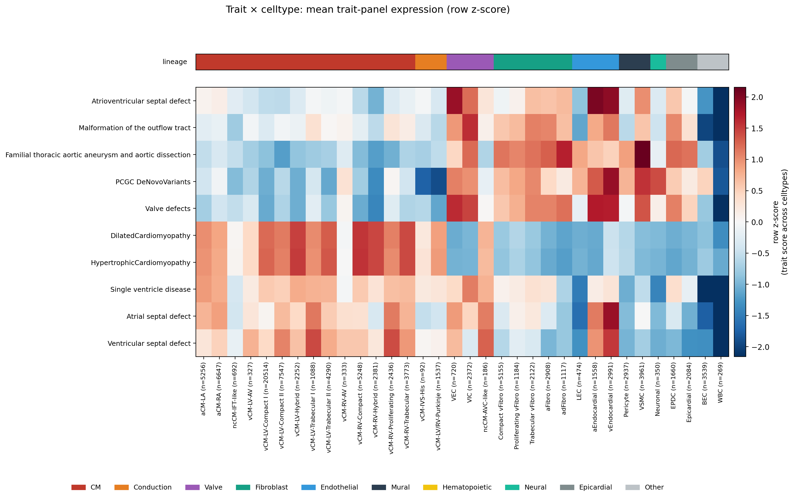
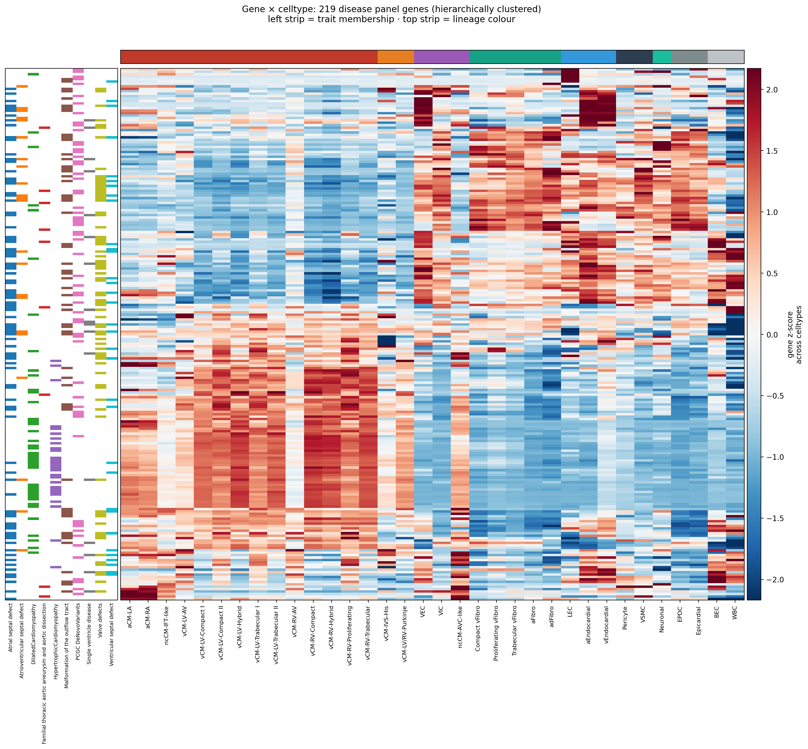
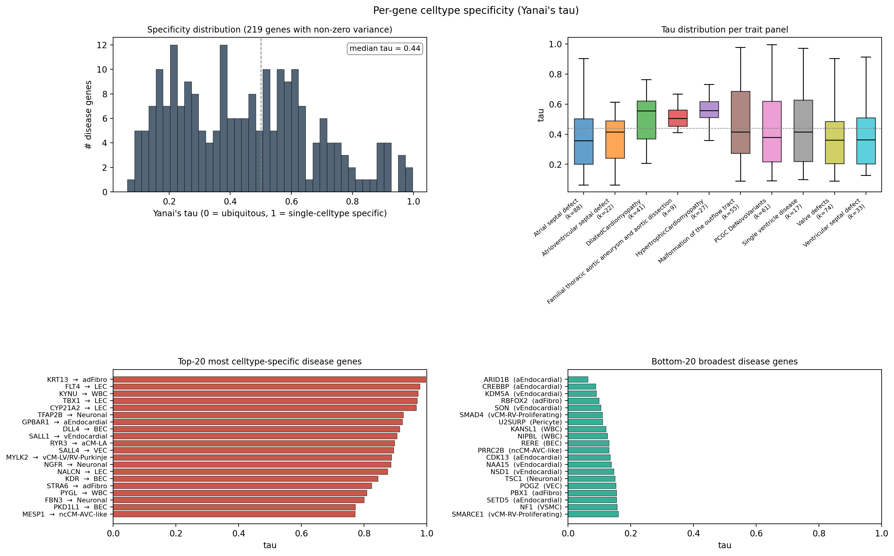
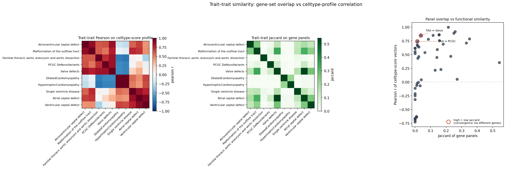

# Heart-disease gene expression landscape — PCW12 atlas

## Question
Beyond "valve vs non-valve", how do the 221 heart-disease panel genes
distribute across the 34 PCW12 cell types? Which celltypes light up
for each trait? Which genes are celltype-specific vs broadly expressed?
Which traits hit similar celltypes — and do they do it via shared genes
or different ones?

## Method (one-line)
Per-celltype mean log1p expression of the imputed (cell × 221-gene)
matrix gives a 34 × 221 reference. From it: trait scores per celltype,
Yanai's tau per gene, trait–trait Pearson on celltype-score profiles,
and trait–trait Jaccard on gene-membership sets.

> [!NOTE]
> Scope note: the imputed matrix is restricted to a 100 000-cell
> subsample (`adata_imputed_disease_genes.h5ad`). Cell-type proportions
> are preserved; the reduced cell count only affects within-celltype
> sampling noise, not the celltype means we use here.

---

## Figure A — Trait × celltype landscape

The heatmap separates into **two reciprocal blocks**:

| Block | Traits | Top celltypes |
|---|---|---|
| **Myocardial** (CM lineage red, valve/EC blue) | HCM, DCM | vCM-RV-Compact, vCM-LV-Hybrid, vCM-LV-Compact I/II — i.e. the working ventricular myocardium |
| **Cushion / mesenchymal / endothelial** (CM blue, valve+EC+fibro red) | Valve defects, AVSD, OFT, PCGC, TAA, ASD, VSD, Single-ventricle | aEndocardial / vEndocardial / VEC / VIC / VSMC / Fibroblasts |

Three observations stand out:

1. **HCM and DCM are essentially the same celltype profile** (Pearson r = 0.998 — see Fig D). They differ in genes (only 12 shared, Jaccard 0.21) but converge on the same working-myocyte celltype.
2. **TAA is mesenchymal, not valve-specific.** Top celltypes: VSMC, adFibro, aFibro. This visualises in one figure why the previous valve-vs-fibroblast robustness check showed TAA failing — the panel marks any aortic-mesenchymal cell, not valves uniquely.
3. **WBC and BEC are *deep blue* across nearly every trait** — disease panels carry essentially no hematopoietic or capillary-endothelial signal. This is a useful negative-control band on the right edge of the heatmap.

---

## Figure B — Gene × celltype heatmap (219 genes, hierarchically clustered)

Hierarchical clustering reveals **3 dominant gene modules**:

| Module | Where it lights up | Trait membership pattern |
|---|---|---|
| **Module M-CM** (mid-bottom rows) | All vCM subtypes red, valve/EC/fibro blue | Heavy enrichment of HCM/DCM membership, plus PCGC and septal-CHD genes that happen to be CM-expressed |
| **Module M-cushion** (middle bands) | VEC, VIC, ncCM-AVC-like, aEndocardial, vEndocardial red; CM blue | Almost exclusively Valve_defects, AVSD, OFT, ASD, VSD membership |
| **Module M-mesenchymal** (top bands) | LEC / aEndocardial / VSMC / Fibroblasts red | TAA + PCGC + scattered CHD genes — mesenchymal/aortopathy program |

The trait-membership strip on the left makes this readable: brown
ribbons (HCM) cluster in M-CM, purple ribbons (Valve_defects) cluster
in M-cushion, dark green ribbons (TAA) sit in M-mesenchymal.

---

## Figure C — Per-gene specificity (Yanai's tau)

| Statistic | Value |
|---|---:|
| Genes with non-zero variance | 219 / 221 |
| Median tau | **0.44** |
| Bimodal-ish, with a long tail of celltype-specific genes (tau > 0.8) | yes |

### Top-15 most celltype-specific disease genes (with biology)

| Gene | tau | Best celltype | Biology |
|---|---:|---|---|
| KRT13 | 0.996 | adFibro | adventitial keratin — somewhat unexpected in PCGC panel |
| FLT4 | 0.978 | LEC | VEGFR3 — classic lymphangiogenesis / Milroy disease |
| KYNU | 0.973 | WBC | kynureninase — immune metabolism, present in 4 CHD panels |
| **TBX1** | **0.970** | **LEC** | **DiGeorge / 22q11 — pharyngeal-arch master regulator. Expression in LEC at PCW12 is biologically reasonable (lymphatic endothelium is pharyngeal-arch derived).** |
| CYP21A2 | 0.966 | LEC | adrenal steroidogenesis (PCGC variants) |
| **TFAP2B** | **0.925** | **Neuronal** | **Char syndrome (PDA) — a neural-crest TF, expectedly neural-specific** |
| GPBAR1 | 0.922 | aEndocardial | bile-acid receptor; surprising endocardial signal |
| **DLL4** | **0.914** | **BEC** | **Notch ligand, the canonical arterial-EC marker** |
| **SALL1** | **0.905** | **vEndocardial** | **Townes-Brocks; endocardial-cushion role consistent** |
| RYR3 | 0.897 | aCM-LA | ryanodine R3 — atrial-CM Ca²⁺ release isoform |
| **SALL4** | **0.894** | **VEC** | **Okihiro/Duane-radial-ray; valve EC localisation in fetal heart** |
| **MYLK2** | **0.888** | **vCM-LV/RV-Purkinje** | **Cardiac MLC kinase — HCM panel gene that is *Purkinje-restricted* at PCW12. Worth a flag: HCM is usually thought of as a working-myocyte disease, but its panel contains conduction-specific genes.** |
| NGFR | 0.886 | Neuronal | nerve-growth-factor receptor |
| NALCN | 0.875 | LEC | non-selective leak channel |
| KDR | 0.844 | BEC | VEGFR2 — pan-endothelial |

### Broadest disease genes (tau < 0.2 — essentially housekeeping)

ARID1B, CREBBP, KDM5A, RBFOX2, SON, SMAD4, U2SURP, KANSL1, NIPBL,
RERE, PRRC2B, CDK13, NAA15, NSD1, TSC1, POGZ, PBX1, SETD5, NF1, SMARCE1.

> [!NOTE]
> The "broad" tail is dominated by **chromatin remodellers, splicing
> factors, and general transcriptional regulators** (CREBBP, KDM5A,
> KANSL1, NIPBL, NSD1, SETD5, ARID1B, SMARCE1) — exactly the genes that
> are recurrently mutated in syndromic CHD (Cornelia de Lange, Coffin-
> Siris, Sotos, KAT6A) but cause disease via *dosage-sensitive
> developmental regulation* rather than tissue-specific expression.
> Ubiquitous expression and dosage sensitivity is consistent with the
> haploinsufficiency mechanism for these syndromes.

### Per-trait tau distributions (top-right boxplot)
- **TAA** has the highest median tau (~0.55) and tightest IQR — its 9-gene panel is uniformly mesenchymal-specific.
- **Valve_defects** and **ASD** have the lowest median tau (~0.36) — broader panels with many transcriptional regulators.
- HCM and DCM tau distributions are nearly identical (median ~0.5) — consistent with their celltype-profile correlation of 0.998.

---

## Figure D — Trait–trait similarity

The Pearson heatmap (left) cleanly **block-diagonalises** into:
- **Myocardial block**: HCM ↔ DCM (r = 0.998)
- **Cushion / mesenchymal block**: AVSD, OFT, TAA, PCGC, Valve_defects all r > 0.7 with each other
- **Septal block**: ASD, VSD, Single-ventricle pairwise r ~ 0.78–0.92

The Jaccard heatmap (middle) shows a *much* sparser pattern. Most
trait pairs have Jaccard < 0.05 even when their celltype profiles are
near-identical.

### The interesting cases — high r, low Jaccard (scatter, right)

Two pairs are flagged where celltype-profile correlation > 0.7 but
panel overlap < 4 %:

| Pair | Pearson r | Jaccard | n shared genes | Interpretation |
|---|---:|---:|---:|---|
| **TAA ↔ Valve defects** | **0.85** | 0.037 | **3** | Two largely non-overlapping gene panels converge on the same mesenchymal-cushion celltypes. The "valve-defects" panel and the "TAA" panel are independently curated for different anatomical phenotypes, yet they hit the same VEC/VIC/Endocardial/VSMC cells via different genes. |
| **TAA ↔ PCGC** | 0.75 | ~0.03 | ~2 | Same convergence onto VSMC + adFibro + LEC. PCGC de-novo variants implicate the same mesenchymal program even with almost no gene overlap. |

These are the most biologically informative findings. **Convergence at
the celltype level despite gene-set independence is exactly the signal
you want for a fetal cardiac atlas: it argues that disease loci across
phenotypes are tagging a shared developmental program (here, EMT-derived
cushion / aortic mesenchyme), not just enrichment artifacts.**

The full ranked table (45 trait pairs) is in `trait_similarity.tsv`.

---

## Top biological takeaways

1. **The disease panel decomposes into 3 clean expression modules** that map onto well-known developmental compartments: working myocardium, AV/OFT cushion mesenchyme, and aortic/general mesenchyme. Module assignment is reproducible from clustering alone (Fig B).
2. **HCM ≅ DCM at the celltype-profile level** (r = 0.998). Different genes, same cells. Cardiomyopathy panels are essentially indistinguishable as transcriptional readouts of "working ventricular myocyte".
3. **TAA panel is a mesenchymal-program signature, not an aorta-specific one.** It correlates with valve-defect, PCGC, and AVSD profiles at r ≈ 0.75–0.85 despite minimal gene overlap. This re-explains the prior task's robustness-test failure (TAA AUC < 0.5 vs fibroblast) at celltype-profile resolution.
4. **MYLK2 → Purkinje is a noteworthy outlier in the HCM panel.** Most HCM genes are working-myocyte specific (MYH7, MYBPC3, etc., visible in M-CM); MYLK2 instead localises specifically to the conduction system at PCW12. Worth flagging if you ever subset the HCM panel by celltype.
5. **Specific vs broad disease genes track mechanism.** High-tau disease genes are tissue-program genes (TBX1, DLL4, KDR, SALL1/4, RYR3); low-tau disease genes are chromatin/splicing regulators (NIPBL, ARID1B, NSD1, KANSL1) — consistent with the dosage-sensitive haploinsufficiency syndromic-CHD model.
6. **WBC and BEC carry essentially no disease signal** for any of the 10 traits. Useful as biological-negative-control celltypes in any downstream test.

## Caveats
- 100k-cell subsample. Per-celltype means are stable but the smallest celltypes (vCM-IVS-His n=92, vCM-LV-RV-Purkinje n=1537, ncCM-AVC-like n=186) have wider sampling error. Trust modules over single-cell-type single-gene calls.
- Imputed expression. tau is computed on celltype means after scVI-style smoothing; absolute tau values may compress vs raw counts. Relative ranking is robust.
- The 221-gene universe is small and CHD-biased. Tau is an "intra-CHD-panel" specificity, not a genome-wide one — interpret accordingly.
- Single-donor PCW12 — no donor-level replication possible. All findings are descriptive of *this* atlas.

## Files
- `trait_by_celltype_means.tsv` — 10 × 34 matrix (Fig A source)
- `gene_specificity_tau.tsv` — 221 rows: gene, tau, max_celltype, traits
- `trait_similarity.tsv` — 45 pairs: jaccard, pearson, n_overlap
- `figA_trait_by_celltype.{png,pdf}`
- `figB_gene_by_celltype.{png,pdf}`
- `figC_gene_specificity.{png,pdf}`
- `figD_trait_similarity.{png,pdf}`
- Script: `PCW12_analysis/scripts/12_disease_gene_landscape.py`
